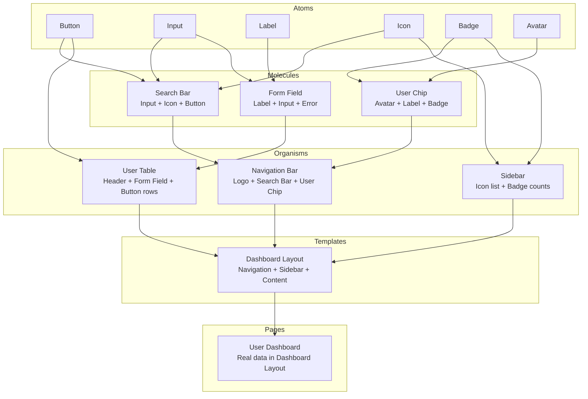
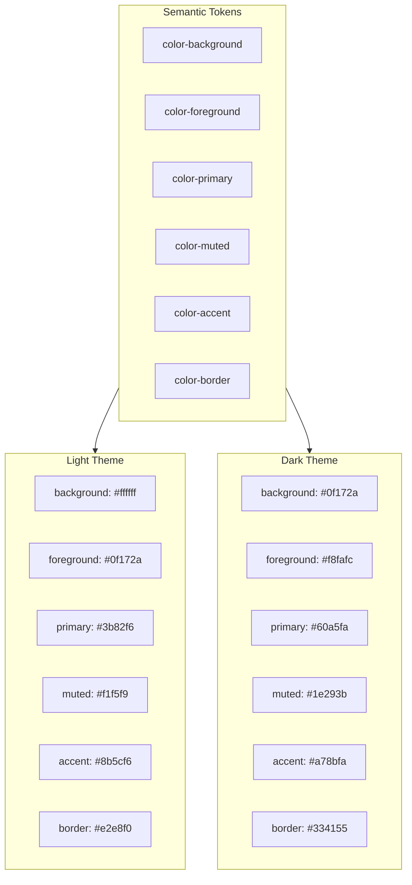

```mermaid
graph LR
    subgraph Mobile["Mobile<br/>0 - 639px"]
        M1[Single column]
        M2[Stacked navigation]
        M3[Full-width cards]
    end

    subgraph Tablet["Tablet<br/>640 - 1023px"]
        T1[Two-column grid]
        T2[Side drawer nav]
        T3[Half-width cards]
    end

    subgraph Desktop["Desktop<br/>1024 - 1279px"]
        D1[Three-column grid]
        D2[Persistent sidebar]
        D3[Third-width cards]
    end

    subgraph Wide["Wide<br/>1280px+"]
        W1[Max-width container]
        W2[Persistent sidebar]
        W3[Quarter-width cards]
    end

    Mobile -->|640px| Tablet
    Tablet -->|1024px| Desktop
    Desktop -->|1280px| Wide
```

# Design System Diagram Templates

Templates for visualizing design systems: component hierarchies, token systems, package architecture, responsive breakpoints, and theme systems. Each section provides both Mermaid templates (for documentation) and Excalidraw layout guidance (for detailed visual diagrams).

---

## 1. Atomic Design Hierarchy

Visualize the atoms -> molecules -> organisms -> templates -> pages progression.

### When to Use

- Onboarding new designers or developers to the design system
- Documenting component inventory and categorization
- Planning which components to build and in what order

### Mermaid Template



### Excalidraw Layout Guidance

**Pattern: Layered Hexagon (nested rings)**

Layout as concentric layers, bottom to top:

1. **Atoms layer** (bottom, y: 600) — Small rectangles in a horizontal row. Use Secondary fill (`#60a5fa`) with secondary stroke. Width: 120px each, spaced 40px apart.
2. **Molecules layer** (y: 400) — Medium rectangles. Use Primary fill (`#3b82f6`). Width: 180px. Draw thin arrows from constituent atoms up to each molecule.
3. **Organisms layer** (y: 200) — Larger rectangles. Use Tertiary fill (`#93c5fd`). Width: 240px. Arrows from constituent molecules.
4. **Templates layer** (y: 50) — Wide rectangles. Use Start/Trigger fill (`#fed7aa`). Width: 320px.
5. **Pages layer** (top, y: -100) — Full-width rectangle. Use End/Success fill (`#a7f3d0`). Width: 400px.

Label each layer with free-floating text on the left margin. Use Title color (`#1e40af`) for layer labels. Draw dashed vertical lines on each side to visually separate the layers.

Evidence artifacts: inside each component box, add a small monospace text element showing the component name as code (e.g., `<Button />`, `<SearchBar />`).

---

## 2. Design Token System

Visualize the token hierarchy: global -> alias -> component.

### When to Use

- Documenting design token architecture
- Explaining how theme changes propagate
- Planning token migration from hardcoded values

### Mermaid Template

```mermaid
graph TD
    subgraph Global Tokens
        GT1[color-blue-500: #3b82f6]
        GT2[color-gray-900: #111827]
        GT3[spacing-4: 16px]
        GT4[radius-md: 6px]
        GT5[font-size-base: 16px]
    end

    subgraph Alias Tokens
        AT1[color-primary: {color-blue-500}]
        AT2[color-text: {color-gray-900}]
        AT3[spacing-inline-md: {spacing-4}]
        AT4[radius-button: {radius-md}]
    end

    subgraph Component Tokens
        CT1[button-bg-primary: {color-primary}]
        CT2[button-text: white]
        CT3[button-padding: {spacing-inline-md}]
        CT4[button-radius: {radius-button}]
        CT5[input-border-color: {color-primary}]
        CT6[input-text: {color-text}]
    end

    GT1 --> AT1
    GT2 --> AT2
    GT3 --> AT3
    GT4 --> AT4

    AT1 --> CT1
    AT1 --> CT5
    AT2 --> CT6
    AT3 --> CT3
    AT4 --> CT4
```

### Excalidraw Layout Guidance

**Pattern: Tree (top-down, three tiers)**

1. **Global tokens** (top row, y: 50) — Small rounded rectangles. Use AI/LLM fill (`#ddd6fe`) with violet stroke. Width: 160px. Each box shows the token name and value in monospace.
2. **Alias tokens** (middle row, y: 250) — Medium rectangles. Use Decision fill (`#fef3c7`). Width: 180px. Show the token name and its reference in braces.
3. **Component tokens** (bottom row, y: 450) — Larger rectangles. Use Primary fill (`#3b82f6`). Width: 200px. Group by component (button tokens, input tokens).

Arrows flow top-down from global to alias to component. Use thin arrows (strokeWidth: 1) since there will be many. Color arrows using the structural line color (`#64748b`).

Title at top: "Design Token Hierarchy" in Title color (`#1e40af`), fontSize: 24.

---

## 3. Component API Documentation

Visualize component props, events, and slots.

### When to Use

- Documenting component API surface
- Designing component interfaces before implementation
- Creating component catalog entries

### Mermaid Template

```mermaid
graph LR
    subgraph Props["Props (Inputs)"]
        P1[label: string]
        P2[variant: primary | secondary | ghost]
        P3[size: sm | md | lg]
        P4[disabled: boolean]
        P5[iconStart: ReactNode]
    end

    subgraph Component["Button Component"]
        C[Render Button<br/>with props applied]
    end

    subgraph Events["Events (Outputs)"]
        E1[onClick: MouseEventHandler]
        E2[onFocus: FocusEventHandler]
        E3[onHover: MouseEventHandler]
    end

    Props --> Component
    Component --> Events
```

### Excalidraw Layout Guidance

**Pattern: Assembly Line (left-to-right)**

1. **Props column** (left, x: 50) — Stack small rectangles vertically. Use Secondary fill (`#60a5fa`). Each prop is a separate box with the prop name and type in monospace. Width: 200px, height: 40px each, 10px gap.
2. **Component column** (center, x: 350) — Single large rectangle. Use Primary fill (`#3b82f6`) with rounded corners. Width: 200px, height: 200px. Label with component name. Add a small evidence artifact inside showing usage: `<Button variant="primary" />`.
3. **Events column** (right, x: 650) — Stack small rectangles vertically. Use End/Success fill (`#a7f3d0`). Each event is a separate box. Same sizing as props.

Arrows: draw from each prop box to the component, and from the component to each event box. Use horizontal arrows. Thin (strokeWidth: 1) to avoid clutter.

---

## 4. Design System Package Architecture

Visualize how design system packages relate in a monorepo or multi-package setup.

### When to Use

- Documenting monorepo structure for design system packages
- Planning package splitting or consolidation
- Onboarding contributors to the codebase layout

### Mermaid Template: Monorepo Structure

```mermaid
graph TD
    subgraph Monorepo["@acme/design-system"]
        subgraph Core["Core Packages"]
            Tokens["@acme/tokens<br/>Design tokens<br/>(JSON, CSS, JS)"]
            Icons["@acme/icons<br/>SVG icon set<br/>(React, raw SVG)"]
            Utils["@acme/utils<br/>Shared utilities<br/>(clsx, mergeRefs)"]
        end

        subgraph Components["Component Packages"]
            React["@acme/react<br/>React components<br/>(Button, Input, ...)"]
            Vue["@acme/vue<br/>Vue components<br/>(Button, Input, ...)"]
        end

        subgraph Docs["Documentation"]
            Storybook["@acme/storybook<br/>Component playground"]
            Docs["@acme/docs<br/>Documentation site"]
        end

        subgraph Tooling["Tooling"]
            CLI["@acme/cli<br/>Scaffold & generate"]
            ESLint["@acme/eslint-config<br/>Linting rules"]
        end
    end

    Tokens --> React
    Tokens --> Vue
    Icons --> React
    Icons --> Vue
    Utils --> React
    Utils --> Vue
    React --> Storybook
    Vue --> Storybook
    React --> Docs
```

### Mermaid Template: Package Dependency Graph

```mermaid
graph TD
    App[Application<br/>@acme/web-app]
    ReactPkg["@acme/react<br/>v2.4.0"]
    TokensPkg["@acme/tokens<br/>v1.2.0"]
    IconsPkg["@acme/icons<br/>v1.1.0"]
    UtilsPkg["@acme/utils<br/>v1.0.5"]

    App -->|imports| ReactPkg
    App -->|imports| IconsPkg
    ReactPkg -->|depends on| TokensPkg
    ReactPkg -->|depends on| IconsPkg
    ReactPkg -->|depends on| UtilsPkg
    IconsPkg -->|depends on| UtilsPkg
```

### Excalidraw Layout Guidance

**Pattern: Layers (stacked, grouped by purpose)**

Layout the monorepo as stacked layers:

1. **Tooling layer** (top, y: 50) — CLI and config packages. Use Tertiary fill (`#93c5fd`). Width: 160px each.
2. **Core layer** (y: 250) — Tokens, icons, utils. Use Secondary fill (`#60a5fa`). These are the foundation packages.
3. **Component layer** (y: 450) — Framework-specific component packages. Use Primary fill (`#3b82f6`). These consume core packages.
4. **Documentation layer** (bottom, y: 650) — Storybook and docs site. Use Start/Trigger fill (`#fed7aa`). These consume component packages.

Draw dependency arrows upward (components depend on core, not the reverse). Use the structural line color (`#1e3a5f`).

Group each layer with a large transparent rectangle (fill: transparent, stroke: `#64748b`, strokeStyle: dashed) labeled on the left.

---

## 5. Responsive Breakpoint System

Visualize breakpoint boundaries and layout behavior at each viewport width.

### When to Use

- Documenting responsive design strategy
- Planning layout changes across breakpoints
- Debugging responsive layout issues

### Mermaid Template



### Excalidraw Layout Guidance

**Pattern: Side-by-Side (horizontal comparison)**

Layout four viewport representations side by side:

1. **Mobile** (x: 50) — Narrow rectangle representing a phone viewport. Width: 160px, height: 320px. Use Secondary fill (`#60a5fa`), low opacity (30%).
2. **Tablet** (x: 280) — Medium rectangle. Width: 240px, height: 320px. Use Primary fill (`#3b82f6`), low opacity (30%).
3. **Desktop** (x: 580) — Wide rectangle. Width: 320px, height: 320px. Use Tertiary fill (`#93c5fd`), low opacity (30%).
4. **Wide** (x: 960) — Widest rectangle. Width: 400px, height: 320px. Use AI/LLM fill (`#ddd6fe`), low opacity (30%).

Inside each viewport rectangle, draw simplified layout blocks representing the actual content arrangement at that breakpoint (e.g., single column of cards, two columns, three columns).

Between each pair, draw a vertical dashed line with a label showing the breakpoint value (e.g., "640px", "1024px", "1280px") in a small badge above the line.

Top label: "Responsive Breakpoint Map" in Title color.

Evidence artifacts: inside each viewport, show the Tailwind class or CSS media query that applies at that breakpoint (e.g., `@media (min-width: 640px)`).

---

## 6. Theme System

Visualize how light and dark themes map to the same token structure.

### When to Use

- Documenting theme implementation
- Planning dark mode or multi-theme support
- Debugging theme token resolution

### Mermaid Template



### Excalidraw Layout Guidance

**Pattern: Side-by-Side (comparison)**

Layout light and dark themes as two parallel columns:

1. **Semantic tokens** (top center, y: 50) — A row of token name boxes spanning the full width. Use Primary fill (`#3b82f6`). Width: 140px each. These are the abstract token names.

2. **Light theme column** (left half, x: 50, y: 250) — A large container rectangle labeled "Light Theme" with a white background fill (`#ffffff`) and a visible border. Inside, place resolved value boxes showing the actual color as both text and as a small colored swatch rectangle.

3. **Dark theme column** (right half, x: 500, y: 250) — Same structure as light but with a dark background fill (`#0f172a`) and light text (`#f8fafc`). Show resolved values as text and colored swatches.

Draw arrows from each semantic token down to both its light and dark resolved values. Use dashed arrows (strokeStyle: "dashed") to distinguish from primary data flow.

Key detail: for each resolved color, draw a small filled square (20x20px) showing the actual color value. This makes the comparison immediately visual without reading hex codes.

Title: "Theme Token Mapping" in Title color.
