# Mermaid Diagram Patterns

Copy-paste templates for common Mermaid diagram types. Each section includes when to use the type, ready-to-edit templates, and Mermaid-specific gotchas.

---

## 1. Flowchart

**When to use:** Business logic, decision trees, user journeys, process flows.

### Basic Flowchart with Decisions

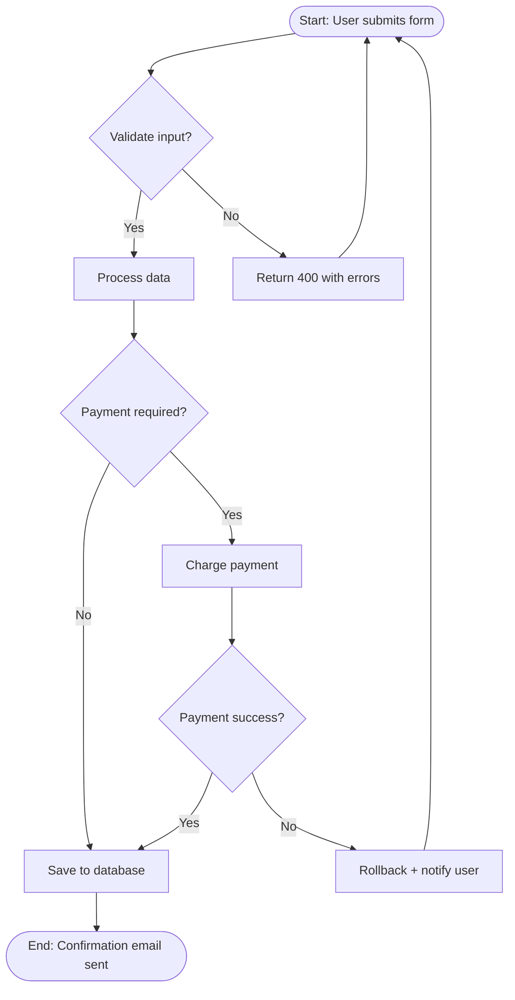

### Flowchart with Subgraphs (Swimlanes)

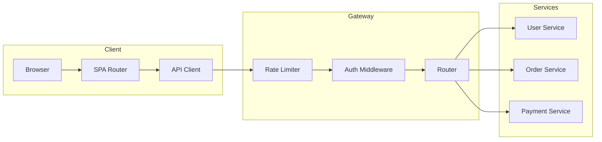

### Flowchart with Styling

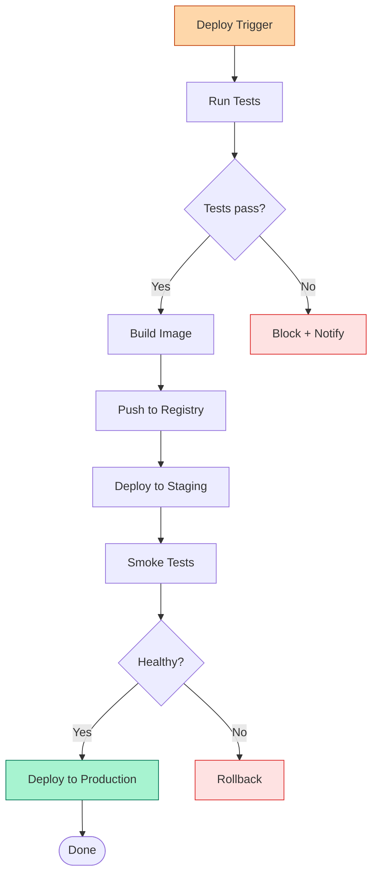

**Gotchas:**
- Use `TD` (top-down) or `LR` (left-right) explicitly. Default is TD.
- Node IDs cannot contain spaces. Use labels with square brackets: `A[This is the label]`.
- `()` for rounded (start/end), `{}` for diamonds (decisions), `[]` for rectangles (processes), `([ ])` for stadium shapes.
- Mermaid reflows nodes automatically. If you need precise control, use Excalidraw instead.
- Long labels break layout. Keep labels under 30 characters.

---

## 2. Sequence Diagram

**When to use:** API interactions, multi-service request flows, authentication flows, event-driven communication.

### API Request/Response

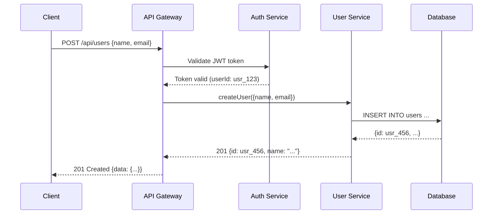

### Sequence with Alt/Opt/Loop Blocks

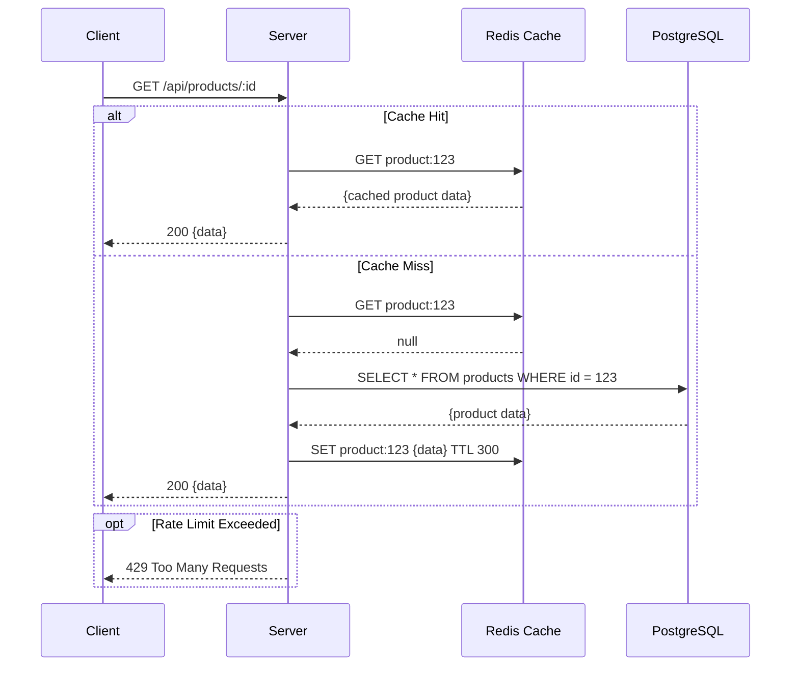

### Event-Driven Sequence

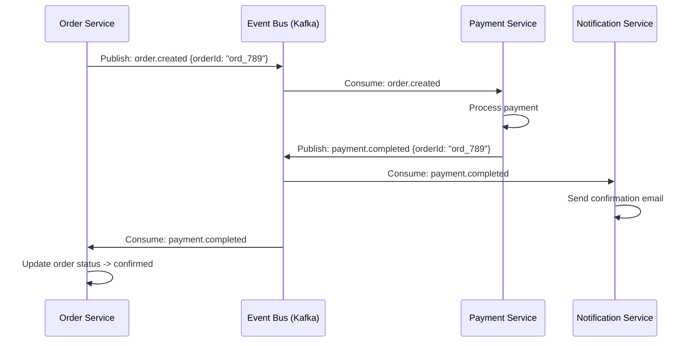

**Gotchas:**
- `->>` for solid arrows (requests), `-->>` for dashed arrows (responses).
- `participant` aliases (`participant A as Long Name`) keep diagram text readable.
- `alt`/`else` for mutually exclusive paths, `opt` for optional, `loop` for repeated steps.
- `Note over A,B: Text` places notes between participants.
- Avoid more than 6-7 participants. Beyond that, use a simplified view plus a detail view.

---

## 3. Class Diagram

**When to use:** OOP design, domain models, entity relationships with methods, design pattern documentation.

### Inheritance and Composition

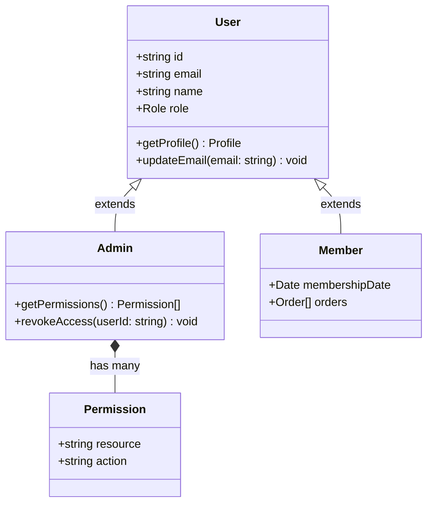

### Service Layer Pattern

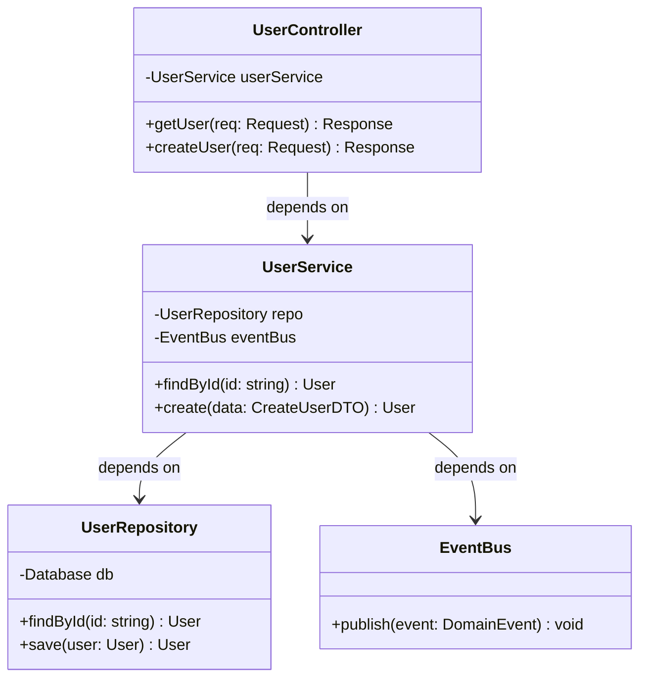

**Gotchas:**
- `<|--` for inheritance, `*--` for composition, `o--` for aggregation, `-->` for dependency, `--` for association.
- `+` public, `-` private, `#` protected (standard UML visibility markers).
- Mermaid class diagrams do not support generics well. Use string labels like `List~User~` with tildes.
- Keep method signatures short. Long signatures break the rendered layout.

---

## 4. ER Diagram

**When to use:** Database schema design, data model documentation, migration planning.

### Basic ER Diagram

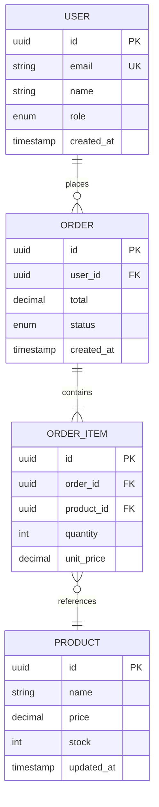

### Multi-Schema ER Diagram

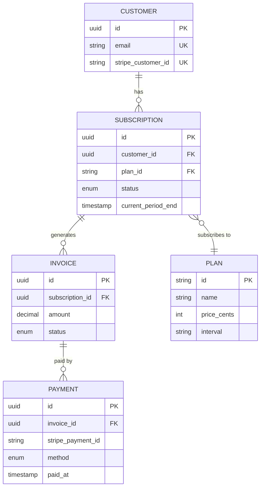

**Gotchas:**
- Relationship syntax: `||--||` (one-to-one), `||--o{` (one-to-many), `}o--o{` (many-to-many).
- `PK` for primary keys, `FK` for foreign keys, `UK` for unique keys — these are labels, not enforced.
- Mermaid ER diagrams do not support composite keys natively. Document them in notes.
- Table names in UPPERCASE by convention (Mermaid requirement for clean rendering).

---

## 5. C4 Architecture

**When to use:** System-level architecture documentation, high-level technical design, onboarding diagrams.

### System Context (Level 1)

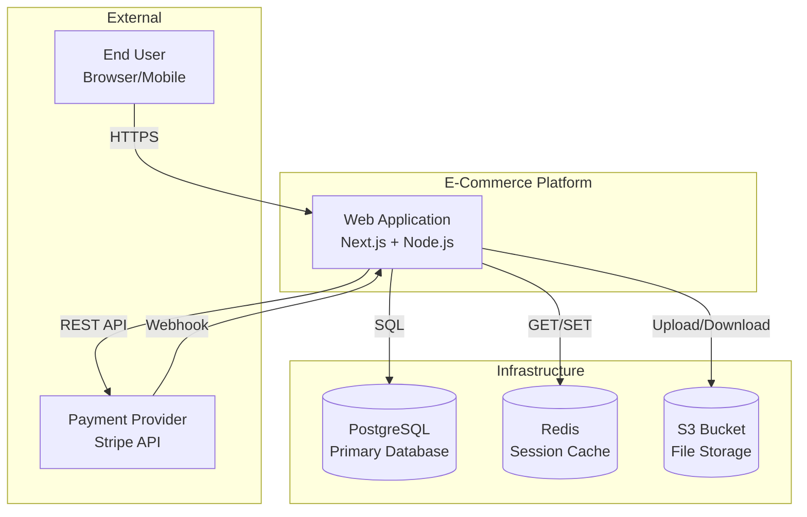

### Container Diagram (Level 2)

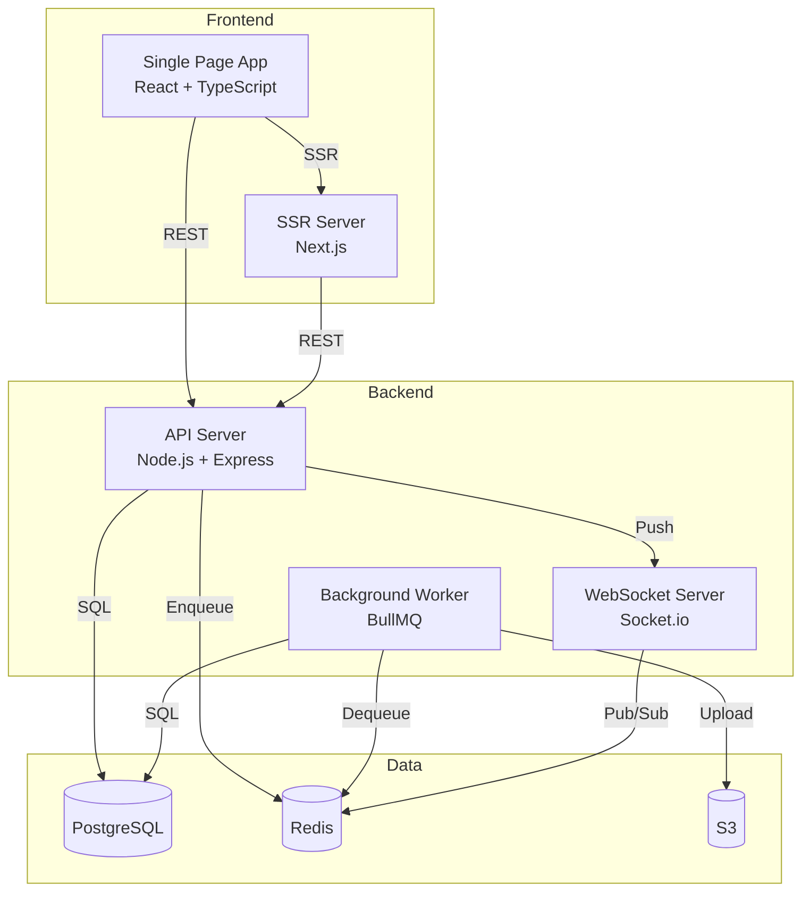

**Gotchas:**
- Mermaid does not have native C4 syntax. Use `graph` with subgraphs and styled nodes.
- Use `[( )]` for database cylinders, `[ ]` for containers, `{{ }}` for external systems.
- C4 is about zoom levels. One diagram per level: Context -> Container -> Component -> Code.
- Keep System Context under 10 elements. Add detail in Container/Component diagrams.

---

## 6. Gantt Chart

**When to use:** Project timelines, sprint planning, release schedules.

### Sprint Timeline

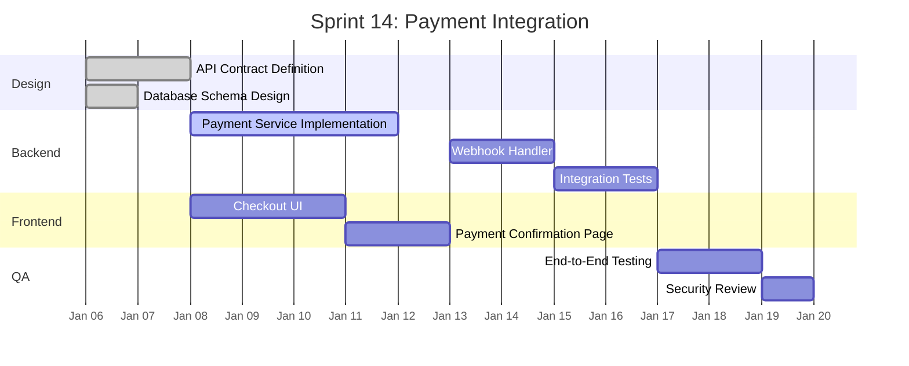

**Gotchas:**
- `dateFormat` is required. Use `YYYY-MM-DD` for consistency.
- Status markers: `done`, `active`, or no marker (future).
- Dependencies: `after taskid` or specific dates.
- `axisFormat` controls the time axis display. `%b %d` = "Jan 06".
- Gantt charts in Mermaid cannot express parallel tracks within the same section. Use multiple sections.

---

## 7. State Diagram

**When to use:** State machines, order/payment/status workflows, protocol states.

### Order State Machine

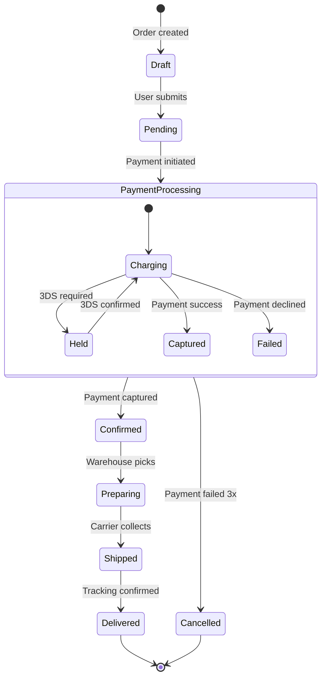

### Feature Flag State

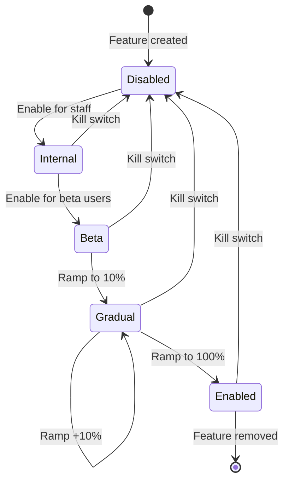

**Gotchas:**
- `stateDiagram-v2` (not `stateDiagram`) — the v2 syntax supports nested states and better rendering.
- `[*]` represents the initial and final pseudostates.
- State names must be unique across the diagram (including nested states).
- Nested states are defined with `state Name { ... }` blocks.
- Transition labels after the colon: `Source --> Target : event description`.

---

## 8. Mindmap

**When to use:** Concept exploration, feature breakdown, information architecture, brainstorming documentation.

### Feature Breakdown

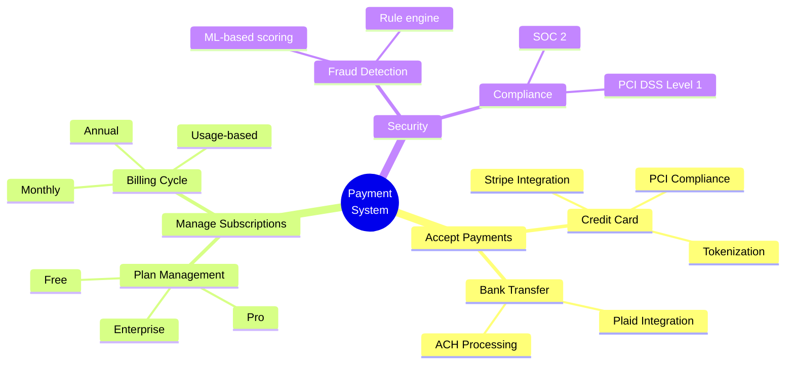

### System Architecture Exploration

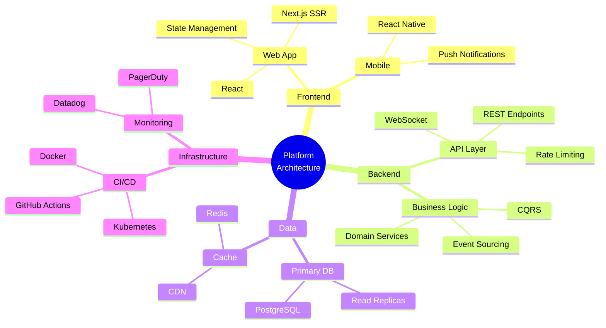

**Gotchas:**
- Mindmap support in Mermaid is relatively new. Test rendering before committing.
- Indentation determines hierarchy. Use consistent spacing (2 or 4 spaces per level).
- `root(( ))` is the center node. All children are indented below it.
- Keep depth to 3-4 levels. Beyond that, the diagram becomes unreadable.
- Line breaks in node text use ` ` or actual newlines within the label.
